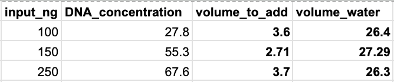

# Illumina DNA Prep
[Edit this page](https://github.com/remygatins/GatinsLabProtocols/edit/main/lab_molec_illuminaDNAlibraryprep.qmd)

The [Illumina DNA Prep kit](https://support-docs.illumina.com/LP/IlluminaDNAPrep/Content/LP/Illumina_DNA/DNA-Prep/Overview.htm) provides a workflow for preparing a whole-genome sequencing pool consisting of up to 384 unique dual-indexed paired-end libraries/samples. In the Gatins lab, we have all of the components needed for the Illumina DNA Prep workflow, including Illumina DNA/RNA unique dual (UD) index adapters: Plates A and B. This means we can uniquely index up to 192 samples on a single lane.

> NOTE: This protocol will detail preparations utilizing 100-500ng of starting DNA so that standardization is not necessary at the end of the protocol. If you will be using this kit to prepare lower-quantity samples, please refer to the protocol online and make changes accordingly.

We have had luck preparing full and half-reactions, so decide which way to prepare depending on your input quantity. All reactions require 100-500ng of DNA to start, so low concentration samples may require the full 30 µl input volume to reach this quantity while higher-concentration samples can be prepped using the halved input volume of 15 µl.

> NOTE: It is easiest to prepare libraries in batches of 16 using strip tubes, but prepare fewer samples for your first time or feel free to upgrade to a full plate if you feel very comfortable with the protocol.

## Prepare samples and reagents
- [ ] Fill an ice bucket
- [ ] Decide which samples to prepare (typically in batches of 16, but this can vary depending on your comfort level with the protocol), and remove them from the freezer to thaw on ice or at room temperature
- [ ] Prepare kit reagents as follows:

| Reagent | Storage box | Preparation |
|-------|----------|----------|
| Tagmentation Buffer 1 (TB1) | -20°C | Bring to room temperature |
| Bead-Linked Transposomes (BLT) | 4°C (bead box) | Bring to room temperature |
| Enhanced PCR Mix (EPM) | -20°C | Thaw on ice |
| Tagment Stop Buffer (TSB) | 4°C | Place at room temperature |
| Tagment Wash Buffer (TWB) | 4°C | Place at room temperature |
| Resuspension Buffer (RSB) | -20°C | Place at room temperature (this isn't used until the very end of the protocol, but it takes forever to thaw so I take it out early) |

## *Step 1:* Tagment Genomic DNA

1. Standardize DNA to 100-500ng in 15 µl (half rxn) or 30 µl (full rxn) in strip tubes or a plate:
|     | half rxn | full rxn |
|-----|----------|----------|
|DNA | 2-15 µl | 2-30 µl |
|nuclease-free water| 15-DNA volume (µl) | 30-DNA volume (µl) |

> NOTE: I like to keep all of this organized in a google/Excel sheet. Here is an example of what this might look like:

2. Vortex BLT for 10 seconds to resuspend. Repeat as necessary. DO NOT centrifuge.
3. Vortex TB1 to mix.
4. For each sample, combine the following volumes to prepare the *Tagmentation Master Mix*. Multiply each volume by the number of samples being processed (these numbers already include extra to account for pipetting error):

|     | half rxn | full rxn |
|-----|----------|----------|
| BLT | 5.5 µl | 11 µl |
| TB1 | 5.5 µl | 11 µl |

5. Vortex the Tagmentation Master Mix for 10 seconds to resuspend.

6a. **IF COMPLETING >16 SAMPLES**
  7a. Divide the Tagmentation Master Mix volume equally into an 8-strip tube
  8a. Using a multichannel pipette, transfer Tagmentation Master Mix from the 8-tube strip to each well of the plate containing a sample.

|     | half rxn | full rxn |
|-----|----------|----------|
| Tagmentation Master Mix | 10 µl | 20 µl |

  9a. Pipette each sample 10 times to mix before switching tips and moving on to the next column.
  10a. Discard the 8-tube strip after Master Mix has been dispensed.

6b. **IF COMPLETING <16 SAMPLES**
  7b. Pipette Tagmentation Master Mix one sample at a time, mixing 10 times with the pipette after each addition. Switch tips in between samples.

|     | half rxn | full rxn |
|-----|----------|----------|
| Tagmentation Master Mix | 10 µl | 20 µl |

> This step can be done on each sample individually if you are working with a small enough number of samples, saving plastics and opportunity for additional pipetting error. If you are preparing >16 samples in one batch, follow option (a).

11. Place on the preprogrammed thermal cycler and run the TAG program:

• Choose the preheat lid option and set to 100°C
• Set the reaction volume to 50 µl
• 55°C for 15 minutes
• Hold at 10°C

> NOTE: In the Gatins Lab, go to "My Folders" and the TAG program is saved in the illumina_dna_prep folder

**Program Duration: ~15 minutes**

## *Step 2:* Post-Tagmentation Clean Up

**Before starting this step, I like to take the Adapter plate that I will be using out and place it on ice to thaw before we reach *Step 3*.**

1. If precipitates are observed in TSB, heat at 37°C for 10 minutes and vortex until precipitates are dissolved.
2. Remove samples from thermal cycler following the TAG program and add TSB to each sample:

|     | half rxn | full rxn |
|-----|----------|----------|
| TSB | 5 µl | 10 µl |

3. Place on the preprogrammed thermal cycler and run the PTC program:

• Choose the preheat lid option and set to 100°C
• Set the reaction volume to 60 μl
• 37°C for 15 minutes
• Hold at 10°C

> NOTE: In the Gatins Lab, go to "My Folders" and the PTC program is saved in the illumina_dna_prep folder

**Program Duration: ~15 minutes**

4. Remove from thermal cycler and place tubes or plate on magnetic stand until liquid is clear (~3 minutes).

> If preparing samples in a plate, ask Lotterhos lab for their plate magnet. Otherwise, use the two-column magnet in our lab for strip tubes.

5. Vortex to mix TWB during this time.
6. Using a multichannel pipette, remove and discard supernatant.
7. Wash the beads as follows:
  a. Remove the samples from the magnetic stand.
  b. Use a deliberately slow pipetting technique to add TWB directly onto the beads:

|     | half rxn | full rxn |
|-----|----------|----------|
| TWB | 50 µl | 100 µl |

  c. Pipette slowly until beads are fully resuspended.
  d. Place the samples on the magnetic stand and wait until the liquid is clear (~3 minutes).
  e. Using a multichannel pipette, remove and discard supernatant.
8. Wash the beads a second time, but *DO NOT* remove and discard supernatant (step e). Keep on the magnetic stand until step Step 3 of the Procedure: *Amplify Tagmented DNA*. The TWB remains in the wells to prevent overdrying of the beads.

## *Step 3:* Amplify Tagmented DNA

1. Invert to mix and centrifuge EPM.
2. Spin down adapter plate in big centrifuge (located in the shared molecular space) for 1 minute at 1000 x g to settle liquid away from the seal.
3. Prepare PCR Master Mix. Multiply each volume by the number of samples being processed:

|     | half rxn | full rxn |
|-----|----------|----------|
| EPM | 11 µl | 22 µl |
| nuclease-free water | 11 µl | 22 µl |

4. Vortex, and then centrifuge the PCR Master Mix at 280 × g for 10 seconds.
5. With the plate on the magnetic stand, use a 200 μl multichannel pipette to remove and discard supernatant.
  •	Foam that remains on the well walls does not adversely affect the library.
6. Remove from magnetic stand.
7. Immediately add PCR Master Mix onto the beads in each sample well and pipette until beads are fully resuspended.

|     | half rxn | full rxn |
|-----|----------|----------|
| PCR Master Mix | 20 µl | 40 µl |

8. Add the appropriate index adapters to each sample:

|     | half rxn | full rxn |
|-----|----------|----------|
| Prepared i7+i5 | 5 µl | 10 µl |

9. Using a pipette set to 20 μl (half rxn) or 40 μl (full rxn), pipette 10 times to mix. Alternatively, seal the sample plate and use a plate shaker at 1600 rpm for 1 minute.
10. Seal the samples and centrifuge at 280 × g for 30 seconds.
11.	Place on the preprogrammed thermal cycler and run the BLT PCR program:
• Choose the preheat lid option and set to 100°C
• 68°C for 3 minutes
• 98°C for 3 minutes
• 5 cycles of:
	98°C for 45 seconds
	62°C for 30 seconds
	68°C for 2 minutes
	68°C for 1 minute
• Hold at 10°C

> NOTE: In the Gatins Lab, go to "My Folders" and the BLT PCR program is saved in the illumina_dna_prep folder

**Program Duration: ~30 minutes**

> If you are moving straight on to library cleanups and quality checks after the PCR finishes, take out the Illumina Purification Beads (IPB), Qubit reagents, and tapestation tape and reagents to all come to room temperature.

*SAFE STOPPING POINT!* Samples can be left in 4°C fridge for up to 30 days at this point.

## *Step 4:* Clean Up Libraries

> *Prep for this step: create fresh 80% ethanol.* Enough for 400 µl per sample.

1.	Centrifuge at 280 × g for 1 minute to collect contents at the bottom of the well.
2.	Place the samples on the magnetic stand and wait until the liquid is clear (~5 minutes).
3.	While you wait, resuspend IPB as follows:
  a.	To mix, invert the bottle manually for 2 minutes, at a rate of 1 inversion per second. While inverting, rotate the bottle 90 degrees every 30 seconds.
  b.	If beads are still adhered to the walls of the container, invert the bottle manually for an additional 1 minute.
4.	Transfer supernatant from each well of the PCR plate to the corresponding well of a new plate/set of tubes.

|     | half rxn | full rxn |
|-----|----------|----------|
| supernatant to transfer | 22.5 µl | 45 µl |

5.	For standard DNA input > 500 bp, perform the following steps.
  a.	Add nuclease-free water to each well-containing supernatant.

|     | half rxn | full rxn |
|-----|----------|----------|
| nuclease-free water | 20 µl | 40 µl |

  b.	Add IPB to each well-containing supernatant and pipette each well 10 times to mix.

|     | half rxn | full rxn |
|-----|----------|----------|
| IPB | 22.5 µl | 45 µl |

  c.	Seal the samples and incubate at room temperature for 5 minutes.
  d.	Place on the magnetic stand and wait until the liquid is clear (~5 minutes).
  e.	During incubation, thoroughly vortex the IPB stock tube, and then add a volume to each well of a **new** plate/set of tubes:

|     | half rxn | full rxn |
|-----|----------|----------|
| IPB (new) | 7.5 µl | 15 µl |

  f.	Transfer supernatant from each well of the first plate into the corresponding well of the new plate/tubes containing undiluted IPB.

|     | half rxn | full rxn |
|-----|----------|----------|
| supernatant | 62.5 µl | 125 µl |

  g.	Pipette each well 10 times to mix. Alternatively, seal the plate and use a plate shaker at 1600 rpm for 1 minute.
  h.	Discard the first plate/set of tubes.

6.	Incubate the sealed samples at room temperature for 5 minutes.
7.	Place on the magnetic stand and wait until the liquid is clear (~5 minutes).
8.	Without disturbing the beads, remove and discard supernatant.
9.	Wash beads as follows.
  a.	With the samples on the magnetic stand, add 200 μl fresh 80% EtOH without mixing.
  b.	Incubate for 30 seconds.
  c.	Without disturbing the beads, remove and discard supernatant.
10.	Wash beads a second time.
11.	Use a 20 μl pipette to remove and discard residual EtOH.
12.	Air-dry on the magnetic stand for 5 minutes.
13.	Remove from the magnetic stand.
14.	Vortex RSB to mix and add to the beads:

|     | half rxn | full rxn |
|-----|----------|----------|
| RSB | 16 µl | 32 µl |

15.	Pipette to resuspend.
16.	Incubate at room temperature for 2 minutes.
17.	Place the plate on the magnetic stand and wait until the liquid is clear (~2 minutes).
18.	Transfer final supernatant to a new PCR plate/set of tubes:

|     | half rxn | full rxn |
|-----|----------|----------|
| final product | 15 µl | 30 µl |

> NOTE: This is quite tricky with the half rxn volume. It is tough to not grab the beads, so just go slow and transfer one sample at a time if you need.

*SAFE STOPPING POINT!* If you are stopping, seal the samples and store at ‑25°C to ‑15°C for up to 30 days.

## *Step 5:* Quality Check

At this point, use the [Qubit 1x High-Sensitivity kit]() to check individual library concentrations and a [D1000 Tapestation analysis]() to check individual library fragment lengths. 

See [this link](https://support-docs.illumina.com/LP/IlluminaDNAPrep/Content/LP/Illumina_DNA/ResourcesReferences_IDP_IDPE_UPIP_PCR.htm) for resources regarding pooling best-practices depending on plexity and individual index sequences (you'll need this for submission to a sequencer if you want them to demultiplex your samples).

